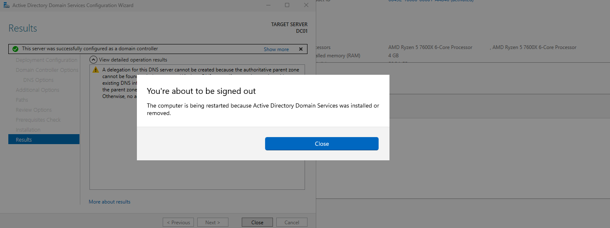

## DC Configuration

1. Log in to the DC — you'll land on the Server Manager main screen.

   

2. Configure a static IP on the DC, since this is required for setting up Active Directory.
   - Get the network information from the Virtual Network Editor. On the toolbar, go to Edit > Virtual Network Editor.
   - Note the entry with type NAT — this is the scope you'll use to configure the DC's static IP.

   
   

3. Assign a static IP to the DC:
   - Open Network Connections > adapter properties > IPv4.
   - IP address: `192.168.92.10`
   - Subnet mask: `255.255.255.0`
   - Default gateway: `192.168.92.2` (confirm via NAT Settings)
   - Preferred DNS: `192.168.92.10` (the DC will host its own DNS)

   
   
   

4. Verify the static IP is applied. For example, we will ping the DC's own IP from the Command Prompt: `192.168.92.10`
   - A successful reply (0% packet loss) confirms the IP is correctly assigned.

   

5. Rename the DC (e.g. to `DC01`) before promoting it to a domain controller. Renaming after promotion can cause AD/DNS issues, so it's best to do this now.
   - Restart your computer as requested.

   

6. Server Manager will reopen. In the menu, select Manage at the top-right of the window, then Add Roles and Features.
   - Click through the wizard until you reach Server Roles.
   - Check AD DS (Active Directory Domain Services) and DNS Server. If prompted, click Add Features to include required components.
   - Click Install to begin. The installation progress will be shown on screen.

   

7. After installation finishes, a yellow warning icon will appear to the left of Manage in Server Manager. Click it and select the option to promote this server to a domain controller.
   - This opens the Active Directory Domain Services Configuration Wizard.
   - Enter your root domain name (e.g. `yourlab.local`).

   
   

8. Continue through the wizard. After the prerequisites check completes, the server will automatically sign you out to apply the changes.

   

9. Once your computer restarts and applies the settings, Server Manager will open up and you can verify the domain has changed to your root domain name.

   
   
