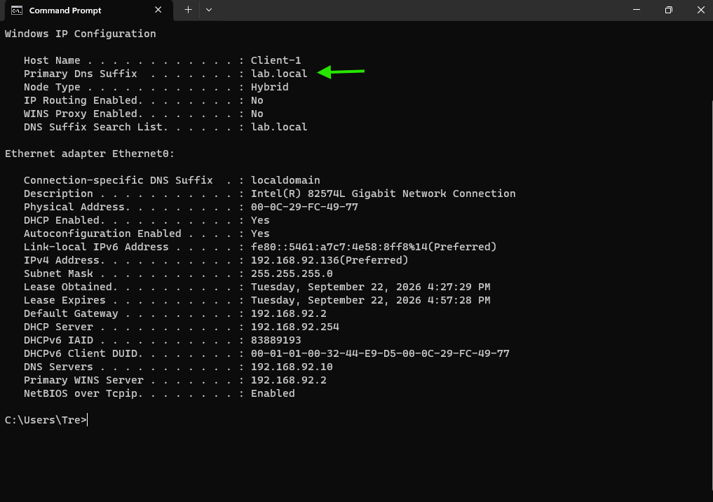
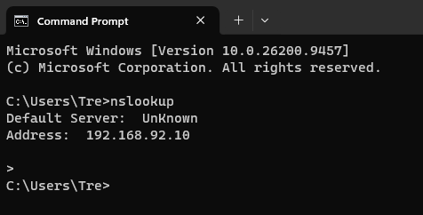
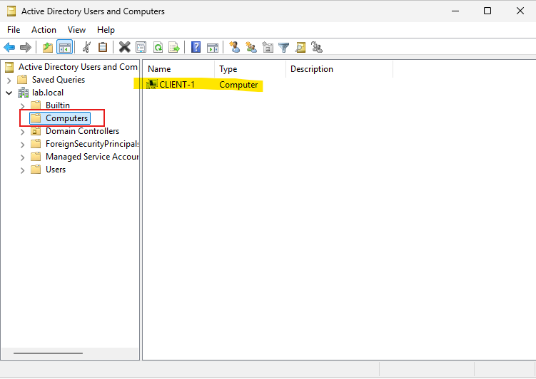

## Windows 11 Client Configuration

*Note: Before continuing ensure your DC is online as you will need it so the client can connect to it.*

1. Go through the setup screens. When you reach the edition selection screen, choose **Windows 11 Pro**.
	- Choosing Windows 11 Pro will allow the client to be able to connect to the domain.

 

2. Sign into your Local account with a password after completion of previous screens.
3. Once the computer powers back on, navigate to **Network and Internet** settings.
	- Locate **DNS server assignment** and click **Edit**
	- Enter the DNS settings. This should match 
	- This should match the same DNS as your DC.
	- Save settings.
	- You can confirm settings are correct by pinging the IP of the DC and DNS.

4. Right-click the start menu on the taskbar, then select System.
   - Scroll down to the option that says Domain and Workgroup.
   - Select Change.
   - In the **Computer Name/Domain Changes** window, select the Domain radio button.
5. Enter the domain name that you used to create the DC (e.g. `yourlab.local`).
	- You will be prompted to enter administrator credentials.
	- A dialog box will confirm that the client is now added to the domain. A restart is required to complete the domain join.

6. Post domain join verification: 
- `ipconfig /all`

- `nslookup`

- On the DC: **Server Manager > Tools > Active Directory Users and Computers**, then expand your root domain (e.g., `lab.local`).
- Click the **Computers** container (this is where domain-joined computers live).
	- You'll see that the client is now added to the domain.

